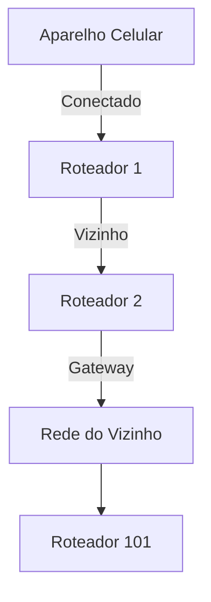
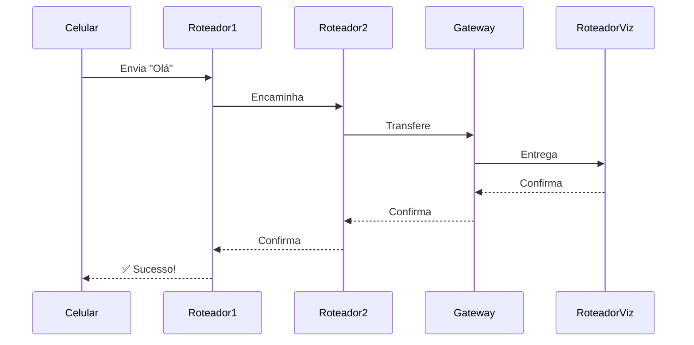

# 📡 Sistema de Redes com Roteamento Inteligente

  
*Diagrama ilustrativo do sistema de redes interconectadas*

## 🚀 Visão Geral

Sistema que simula o envio de mensagens entre dispositivos em redes domésticas interligadas, com roteamento automático e visualização completa do caminho percorrido.



## ✨ Funcionalidades Principais

✅ **Conexão de dispositivos** em múltiplos roteadores  
✅ **Roteamento automático** com caminho ótimo  
✅ **Visualização completa** do trajeto (ida e volta)  
✅ **Confirmação de entrega** em cada salto  
✅ **Conexão entre redes** via gateways  

## 🧩 Componentes do Sistema

### 1. Classe `Roteador` (Cérebro do Sistema)
```java
public class Roteador {
    private int id;
    private ArrayList<Integer> aparelhosConectados;
    private ArrayList<Roteador> vizinhos;
    
    public boolean rotearMensagem(int destino, String msg, ArrayList<Integer> caminho) {
        // Lógica de roteamento inteligente
    }
}
```

### 2. Classe `Rede` (Gerenciadora)
```java
public class Rede {
    private ArrayList<Aparelho> aparelhos;
    private ArrayList<Roteador> roteadores;
    
    public void enviarMensagem(int origem, int destino, String msg) {
        // Coordena todo o processo
    }
}
```

### 3. Classe `Aparelho` (Interface)
```java
public class Aparelho {
    public void enviarMensagem(int destino, String msg) {
        // Método simples para usuário
    }
}
```

## 🛠️ Como Executar

1. Clone o repositório:
```bash
git clone https://github.com/Yacsu77/SistemaDeDistribuicaoDeRedeLan
```

2. Compile e execute:
```bash
javac *.java
java Main
```

## 📊 Fluxo de Mensagens



## 🌟 Exemplo de Saída

```
📤 Celular (1) enviando: "Olá vizinho!"
🔄 Roteador1 (ID:1) processando...
➡️  Encaminhando para Roteador2 (ID:2)
🌉 Passando pelo Gateway (ID:3)
🎯 Entregue no RoteadorViz (ID:101)
🔄 Confirmando por Roteador2 (ID:2)
✅ Mensagem entregue em 4 saltos!
```

## 📌 Casos de Teste

| Cenário | Descrição | Resultado |
|---------|-----------|-----------|
| 1 | Comunicação local | ✔️ Entrega imediata |
| 2 | Entre redes | ✔️ Rota com gateways |
| 3 | Dispositivo offline | ❌ Falha controlada |

## 📈 Melhorias Futuras

- [ ] Adicionar limite de saltos (TTL)
- [ ] Implementar prioridade de mensagens
- [ ] Adicionar criptografia ponta-a-ponta
- [ ] Interface gráfica para visualização

## 🤝 Contribuição

Contribuições são bem-vindas! Siga os passos:

1. Faça um fork do projeto
2. Crie sua branch (`git checkout -b feature/incrivel`)
3. Commit suas mudanças (`git commit -m 'Add incrível feature'`)
4. Push para a branch (`git push origin feature/incrivel`)
5. Abra um Pull Request

## 📄 Licença

MIT License © 2025 [Yacsu77]

---

Made with ❤️ by [Yacsu77] 
